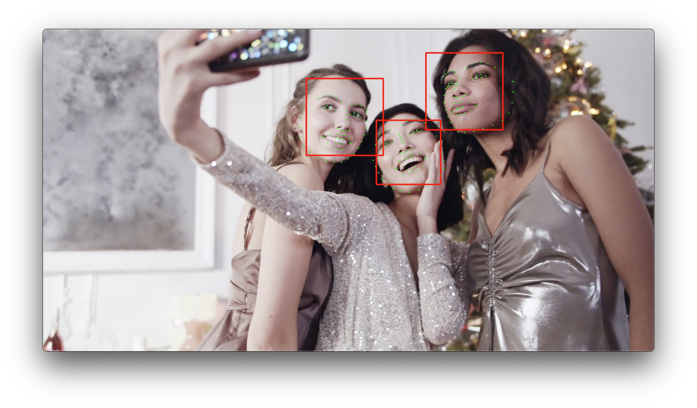

# OpenCV and Dlib Face Detection

Face detection is very common and works on many platforms such as Windows, Mac, Linux, Raspberry Pi, Jetson-nano, etc.
But when starting to build the environment following web sites, we often encounter some environmental problems.
I hope this repository helps someone who starts face recognition.




## Directory Structure

```
face_recognition/
  cv_cpp/            : OpenCV C++
  cv_py/             : OpenCV Python
  dlib_cpp/          : Dlib C++
  dlib_py/           : Dlib Python
```

## Install required tools for Mac

```
./install_mac.sh
```

## Sample image and video

I used free image and video for testing.

Free image from:

    https://www.pakutaso.com/20161111328post-9609.html

Free video from:

    https://www.pexels.com/ja-jp/video/-3402765/

